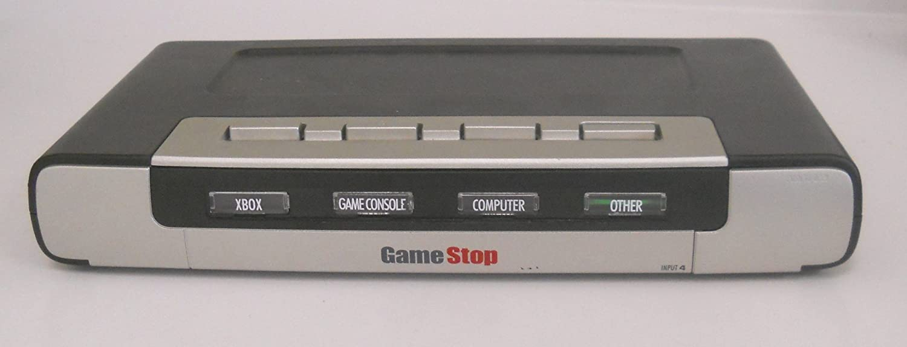
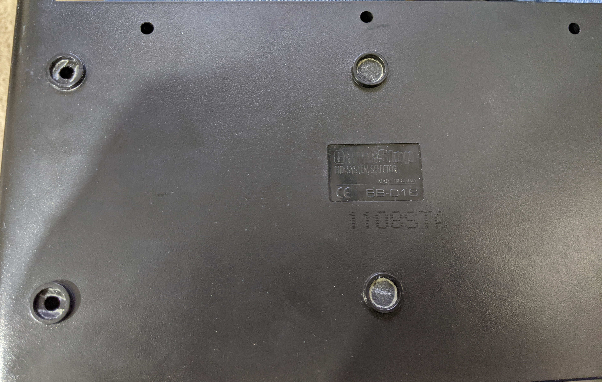
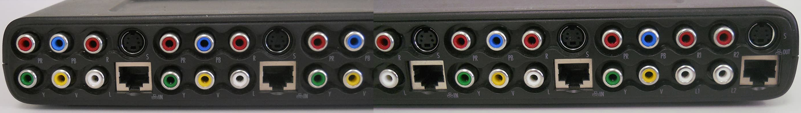
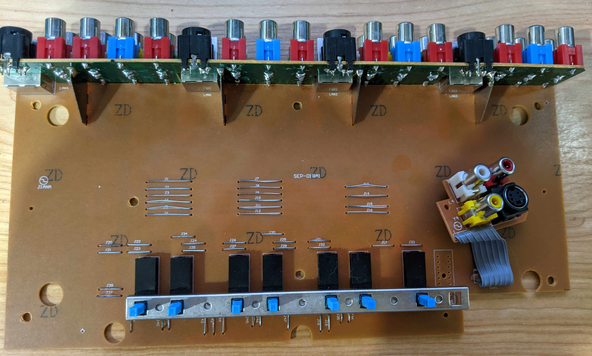
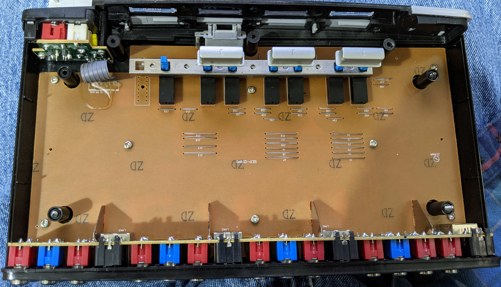
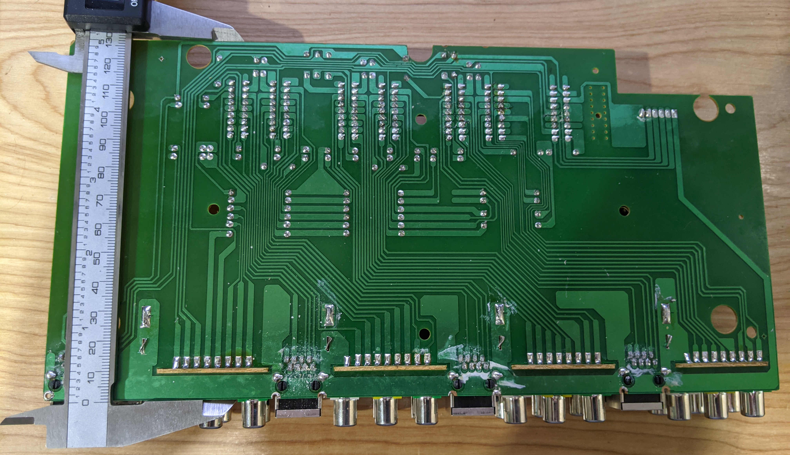
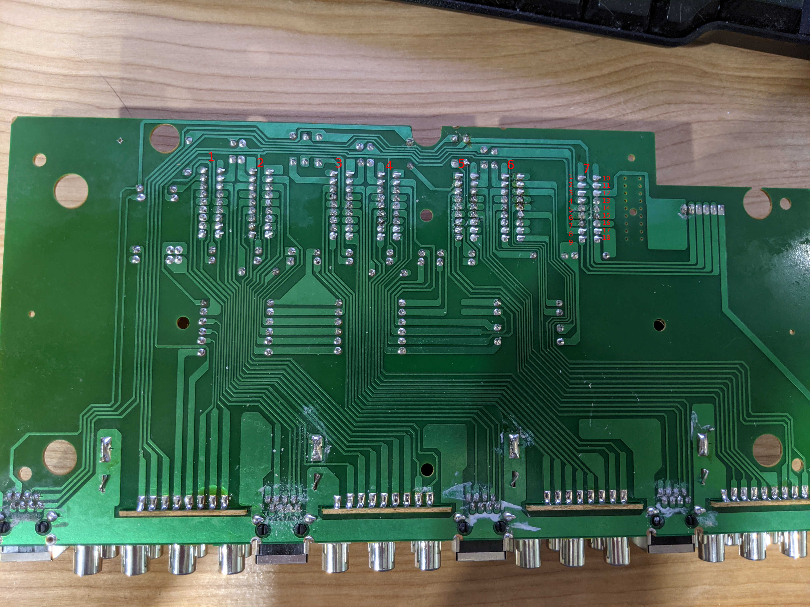

# GameStop HD System Selector

This is a very basic AV switch with 3 full inputs, and 1 reduced front input.
The full inputs support Right and Left unbalanced audio, Composite video,
S-Video, Component Video, and 100Mbps Ethernet. The reduced full input only
supports Right and Left audio, Composite video and S-Video.

The circuit is very simplistic, and uses 6PDT switches to select signals, with
a mechanical interlock to try and prevent multiple inputs being selected at a
time. It is a completely passive circuit with no redriving or other components
on the board besides the switches and connectors. The Ethernet interface is
only wired for 100Mbps with 4 wires, and there is no attempt to control the
impedances of the traces or anything.

The PCB itself is a single sided PCB that uses jumpers to bridge traces (see
schematic in [the original folder](gamestop-av-switch-original)), but once the
[jumpers are removed](gamestop-av-switch-no-jumpers), the schematic is
simplified dramatically.

There are very few silkscreen markings on the PCB, and no pin markings. See the
annotated image for pinout references in regards to the PCB.

